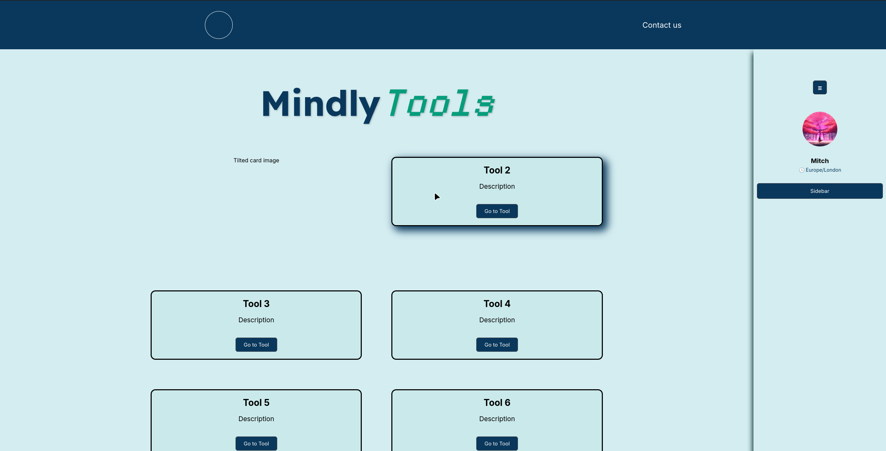

# MindlyTools

Deployment link:
https://mindlytools-1.onrender.com/

> [!IMPORTANT]
> This project is still in development!



MindlyTools is a multipurpose website used to access multiple useless tools

Some of those Tools include:

- Todo list
- calculator
- Habit tracker
- Calendar
- Note taking
- Pomodoro timer (Coming soon)
- Normal timer (Coming soon)

## Tech stack

This project uses:

React 19

CSS3

JavaScript

Firebase

# Credits

## Front end

Mamta - Css styling, colourschemeing, created tools and React routing

David - Css Styling and positioning

## Backend

Mitch - Project cleanup, templates.

Hamza - Firebase Auth and Validation

# Installation

```
git clone https://github.com/mamtadhone/mindly-tools.git
cd MindlyTools
cd client && npm i && cd ../server && npm i
```

Get the .env files for both the client and server from a teamate. (The .env files live in the root client and server folders.)

> [!NOTE]
> You must run the below command in both the client AND server folder.

`npm run dev` to run the development server
